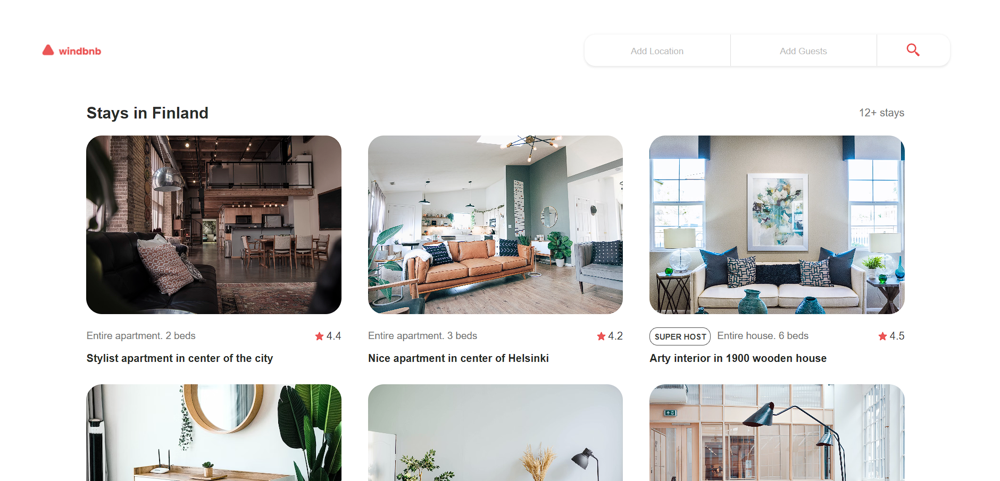
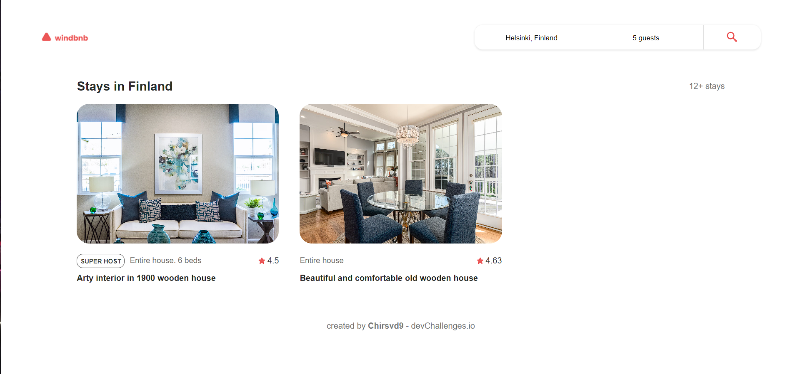

# windbnb-challenge
Challenge de la página DevChallenge.io, consiste en recrear una página sencilla responsive y con un búscador con filtros. Usé Vite, Sass, react-icons y sonner.

DevChallenge.io's challenge consists of recreating a simple responsive page with a search bar and filters. I used Vite, Sass, react-icons, and sonner.

:point_right: [Live preview]()

Imagen 1:

Imagen 2:

